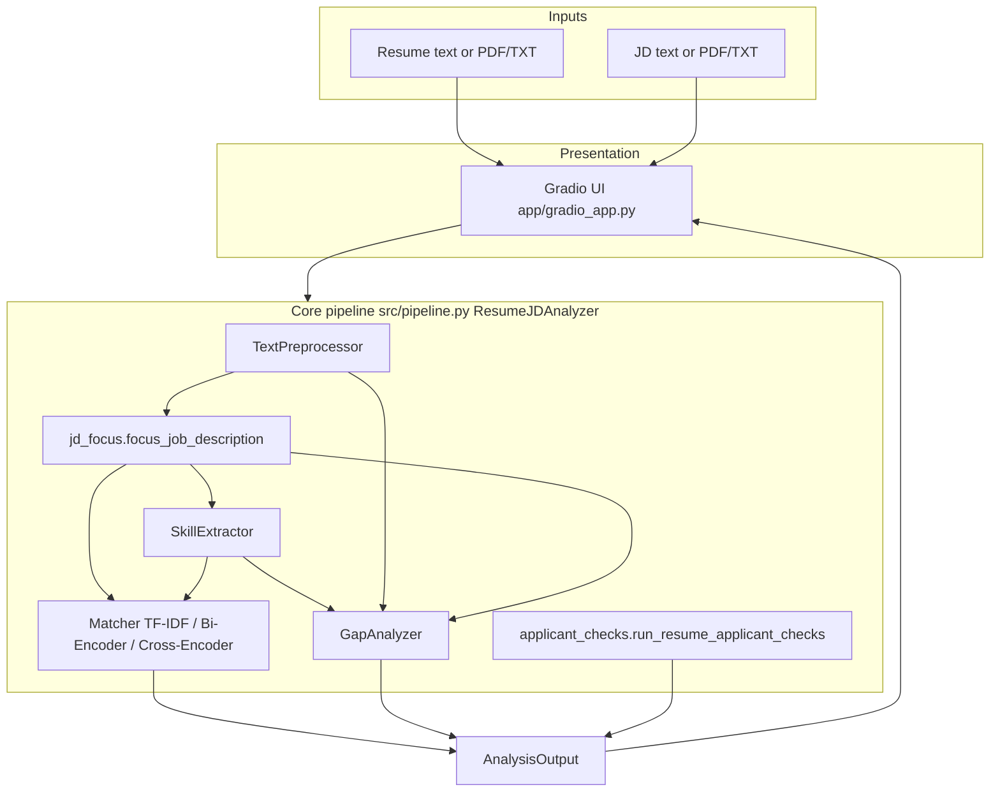

# Resume–JD Analyzer: System Details

This document is the **technical companion** to the course **user guide** in [`README.md`](README.md). The README targets install, usage, high-level documentation, experiments summary, contributions, and limitations for submission; **this file** goes deeper on implementation, data flow, and evaluation mechanics.

**Demo:** Add your hosted Space URL in the README demo section; locally the UI defaults to `http://127.0.0.1:7860` after `python app/gradio_app.py`.

---

## 1. Purpose

The application helps a user compare a **resume** (or CV text) to a **job description (JD)** and obtain:

- A **match score** using one of three NLP matching approaches.
- **Extracted skills** (from a fixed taxonomy) for resume and JD.
- **Skill gaps**: JD skills that do not appear strongly on the resume.
- **Improvement suggestions** tied to gaps and JD evidence.
- **Applicant-oriented help**: JD “focus” preview (what text was used for scoring) and lightweight resume formatting tips.

Scores and gaps are **advisory signals** for alignment and drafting—not hiring decisions.

---

## 2. High-Level Architecture



**Orchestrator:** `ResumeJDAnalyzer` in `src/pipeline.py` runs preprocessing, JD focusing, skill extraction, scoring, gap analysis, and applicant checks, then returns an `AnalysisOutput` dataclass.

---

## 3. Entry Points

| Entry | Path | Role |
|--------|------|------|
| Interactive UI | `app/gradio_app.py` | Loads `ResumeJDAnalyzer`, handles file uploads, calls `analyze()`, renders JSON/text outputs. |
| Programmatic API | `ResumeJDAnalyzer.analyze(resume_text, jd_text, approach)` | Same logic as the UI; suitable for scripts or tests. |
| Batch experiments | `scripts/run_experiments.py` | Scores all labeled pairs with TF-IDF, bi-encoder, and cross-encoder; writes metrics JSON. |
| Optional fine-tuning | `scripts/train_cross_encoder.py` | Fine-tunes the cross-encoder on labeled pairs (see `CrossEncoderMatcher.fine_tune`). |

### 3.1 Running batch scripts from the repository root

`scripts/run_experiments.py` and `scripts/train_cross_encoder.py` prepend the project root to `sys.path` so imports like `from src.evaluation import …` resolve when you run:

```bash
cd ResumeJDAnalyzer
python scripts/run_experiments.py
```

from the folder that contains `src/` and `scripts/`. No manual `PYTHONPATH` is required for these entry points.

---

## 4. End-to-End Data Flow

The following order is fixed in `ResumeJDAnalyzer.analyze()`:

1. **Preprocess resume** → `ProcessedDocument` (normalized text + sections).
2. **Preprocess JD** → `ProcessedDocument`.
3. **Focus JD** → `(jd_focused, meta)` via `focus_job_description(normalized_jd)`.
4. **Extract skills**
   - Resume: always from **full** normalized resume text.
   - JD: from `jd_focused` if its length is **≥ 80 characters** after strip; otherwise from **full** normalized JD (fallback when focus is empty or too short).
5. **Score** the pair using the selected `approach`, with **document-level** comparison on **`jd_focused`** (not the raw full JD), plus **section-weighted overlap** between resume sections and JD tokens (also using `jd_focused`).
6. **Gap analysis** on extracted skill dicts, using **`jd_focused`** as the JD string for priority, JD evidence snippets, and sorting.
7. **Suggestions** from gaps (capped at 12 strings).
8. **Applicant checks** on raw resume + normalized resume + sections (independent of JD approach).

---

## 5. Preprocessing (`src/preprocessing.py`)

### 5.1 `TextPreprocessor.parse_input`

- Accepts either inline `text` or reads from `file_path`.
- **PDF:** uses `PyPDF2.PdfReader`, concatenates per-page `extract_text()` with newlines.
- **Other files:** UTF-8 read with `errors="ignore"`.

### 5.2 `normalize_text`

Applied to both resume and JD before segmentation and most downstream steps:

- Remove null bytes.
- Strip URLs and email-like patterns and long phone-like digit runs (privacy + noise reduction).
- Collapse whitespace; cap multiple newlines.
- **Lowercase** the full string (case-insensitive matching everywhere after this).

### 5.3 `segment_sections` (resume-oriented)

- Splits normalized text into non-empty lines.
- Each line is tested with `re.fullmatch` against `SECTION_PATTERNS` for: `summary`, `experience`, `skills`, `education`, `certifications`.
- **Skills header:** pattern allows a whole line like `skills`, `technical skills`, `core competencies`, `technologies`, or **`core skills`** (optional `core` prefix).
- Lines that match switch the **current section**; following lines append to that section until the next header.
- Non-matching lines go to the current bucket; initial bucket is `other`.
- Returns only non-empty section bodies.

**Note:** Job descriptions rarely follow resume-style headers; JD sections are often unused or mostly `other`. JD understanding relies more on **JD focus** (Section 6) than on this segmenter.

### 5.4 `ProcessedDocument`

| Field | Meaning |
|--------|---------|
| `raw_text` | Original input string (used for applicant tips like length; not re-parsed for skills). |
| `normalized_text` | Cleaned, lowercased full document. |
| `sections` | Dict of section name → body text (may omit keys with no content). |

---

## 6. JD Focus Extraction (`src/jd_focus.py`)

### 6.1 Goal

Long postings (corporate intro, HR mission, benefits, legal footers) **dilute** lexical and neural similarity. The **focus** step keeps a window that usually contains **role description + qualifications**, improving interpretability and scores for real applicants.

### 6.2 Algorithm

1. Split normalized JD into **stripped non-empty lines**.
2. **Start line:** first line matching any **start** regex (e.g. `job description`, `minimum qualifications`, `responsibilit…`, `what you will`, `kla is seeking`, etc.).
3. **End line:** first line **after** the start whose line matches an **end** regex (e.g. `base pay`, `primary location`, `equal opportunity`, `fraudulent job`, `privacy`, etc.). Content **before** that line is kept (exclusive end).
4. Join lines in `[start, end)` into `focused`.
5. **Minimum length:** if `len(focused) < 180` (default `min_chars`), **discard** focus and return the **full** normalized JD; set `meta["used_full_text"] = True` and a note explaining fallback.
6. **Metadata** (`meta` dict): `used_full_text`, `trim_applied`, `start_line_index`, `end_line_index`, `focused_chars`, `full_chars`, `note`.

If no start/end trim occurred but the window is long enough, `note` explains that **no clear headers** were found and the full posting is used (scores may still be diluted).

### 6.3 What Uses Focused JD?

| Consumer | JD text used |
|----------|----------------|
| JD skill extraction | `jd_focused` if ≥ 80 chars else full JD |
| TF-IDF / bi-encoder / cross-encoder **document** comparison | `jd_focused` (always passed as `jd_text` into `_score`) |
| Section overlap tokens | tokenized `jd_focused` |
| Gap analyzer JD string | `jd_focused` (priority + evidence snippets) |

---

## 7. Skill Extraction (`src/skill_extraction.py`)

### 7.1 Method

**Hybrid dictionary matching** (not NER for arbitrary entities):

- Fixed sets: `technical`, `soft`, `certifications` in `DEFAULT_SKILL_DB`.
- **Single-token skills:** presence as a whole token in normalized text (after alias map).
- **Multi-word skills** (e.g. `machine learning`, `power bi`): substring search in normalized whitespace-joined text.
- **Extra certifications:** regex patterns for AWS / Google Cloud / Scrum / PMP style phrases.

### 7.2 Aliases

Examples: `js` → `javascript`, `ml` → `machine learning`, `k8s` → `kubernetes`, `powerbi` → `power bi`, etc.

### 7.3 Limitations (important)

- Only skills **in the dictionary** appear. Domain terms (e.g. “computer vision”, “opencv”, “cuda” as free text) may **not** appear unless added to the DB.
- JD skills after focus may be **fewer** than on the full posting if requirements use vocabulary outside the taxonomy.

---

## 8. Matching Approaches

All final scores are clipped to **[0, 1]**. The UI shows **percentage** = `round(score * 100, 2)`.

### 8.1 Shared: Section-Weighted Overlap (`_section_weighted_overlap`)

For each non-empty resume **section**, compute token overlap with the JD:

\[
\text{overlap(section)} = \frac{|(\text{tokens in section}) \cap (\text{tokens in JD})|}{|\text{tokens in JD}|}
\]

Multiply by a **section weight**, sum, divide by sum of weights:

| Section | Weight |
|---------|--------|
| experience | 1.0 |
| skills | 0.85 |
| certifications | 0.7 |
| summary | 0.5 |
| education | 0.35 |
| other | 0.4 |

If there are no sections or no JD tokens, section score is **0**.

**JD tokens** come from the **focused** JD string passed into `_score`.

### 8.2 TF-IDF (`src/matching/tfidf_matcher.py`)

- `TfidfVectorizer`: English stop words, `ngram_range=(1,2)`, `max_features=5000`.
- Fits on **[resume, jd_focused]** only for that request (no persistent corpus index in the app).
- **Document score:** cosine similarity between the two TF-IDF rows.
- **Final score:** `0.8 * document_score + 0.2 * section_score`.

### 8.3 Bi-Encoder (`src/matching/biencoder_matcher.py`)

- Model: **`sentence-transformers/all-MiniLM-L6-v2`** (`SentenceTransformer`).
- **Document score:** cosine similarity of L2-normalized embeddings of full normalized resume vs **`jd_focused`** (dot product of normalized vectors).
- **Skill alignment score:** for each JD technical skill, take max cosine similarity to any resume technical skill (mean over JD skills); internal threshold 0.45 for “strong pair” listing only.
- **Final score:** `0.6 * document_score + 0.25 * skill_alignment_score + 0.15 * section_score`.

If either technical list is empty, skill alignment is **0** (see `skill_level_similarity`).

### 8.4 Cross-Encoder (`src/matching/crossencoder_matcher.py`)

- Model: **`cross-encoder/ms-marco-MiniLM-L-6-v2`**, `max_length=512` tokens for the pair.
- Raw output is a **logit** (unbounded). The implementation maps it to **[0, 1]** with a **sigmoid** (not raw `clip(logit, 0, 1)`, which would collapse negative logits to zero).
- **Final score:** `0.85 * document_score + 0.15 * section_score`.

**Practical note:** Pairs are **(resume, jd_focused)**. Very long texts are truncated by the model’s max length; focused JD reduces wasted tokens on boilerplate.

### 8.5 Pretrained models: architecture, training context, compute, biases

These details support the “Documentation” depth expected in a course user guide; the README summarizes them for graders.

#### Bi-encoder: `sentence-transformers/all-MiniLM-L6-v2`

| Aspect | Detail |
|--------|--------|
| Architecture | Transformer encoder in the **MiniLM** family, **6 layers**, producing a fixed-size **sentence embedding** (384 dimensions in this checkpoint). |
| Training (high level) | Public sentence-transformers checkpoints are trained with **siamese / sentence-pair** objectives (multiple NL tasks) so that semantically similar sentences have high cosine similarity. See the [model card](https://huggingface.co/sentence-transformers/all-MiniLM-L6-v2) for the upstream recipe and datasets. |
| Inference compute | **CPU** is sufficient for interactive single-pair encoding; **GPU** reduces latency when batching or warming large sessions. First run downloads ~90MB weights (typical). |
| Biases / limitations | **English-centric** general-domain text; may align poorly with non-English resumes, rare job titles, or highly specialized jargon. **Semantic similarity ≠ legal “qualified.”** Similar wording can inflate scores without true competency. |

#### Cross-encoder: `cross-encoder/ms-marco-MiniLM-L-6-v2`

| Aspect | Detail |
|--------|--------|
| Architecture | **Cross-attention** encoder over the **concatenated pair** (resume segment + JD segment), **6 layers**, **single relevance logit** per pair (`num_labels=1`). |
| Training (high level) | Trained on **MS MARCO**–style **query–passage relevance** (passage ranking). Optimized for relatively **short queries** vs **web passages**, not for full CVs vs full careers pages. See the [model card](https://huggingface.co/cross-encoder/ms-marco-MiniLM-L-6-v2). |
| Score calibration | Raw outputs are **logits**, not probabilities. This codebase applies **sigmoid** then clips to \([0,1]\) so UI percentages are interpretable (raw `clip(logit,0,1)` would map most logits to **0**). |
| Inference compute | Similar download size to the bi-encoder; **pairwise** forward pass is heavier than two independent encodings. **512-token** `max_length` truncates long inputs. |
| Biases / limitations | Same **English / web / search** biases as the corpus; **truncation** can drop the exact bullet that mentions a skill; distribution shift vs. hiring use case. |

#### TF-IDF (no pretrained neural weights)

| Aspect | Detail |
|--------|--------|
| Mechanism | `TfidfVectorizer` fits **only** on the two strings passed in (resume vs JD focus) for that request—no global corpus IDF in the app. |
| Compute | Very low; suitable baseline for **lexical** overlap. |
| Limitations | Misses paraphrases; sensitive to token mass from unconcentrated text (mitigated in-app by JD focus). |

**Default UI matcher:** `bi_encoder` is the Gradio default—good tradeoff of **semantic signal**, **skill-alignment term**, and **interactive** CPU latency for pasted text.

### 8.6 Evaluation dataset (`data/evaluation/labeled_pairs.json`)

| Field | Type | Meaning |
|--------|------|---------|
| `resume_id` | string | Groups pairs for **MRR / NDCG** in `run_experiments.py` (multiple JDs per resume possible). |
| `jd_id` | string | Identifier for the posting. |
| `resume_text` | string | Full resume snippet for that example. |
| `jd_text` | string | Full JD snippet as stored (experiments use this **verbatim**; no JD-focus step in the script). |
| `label` | float | Human or rubric score on **1–5** match quality (used ≥ 3.5 as “positive” for binary metrics in `evaluation.py`). |

**Current repository size:** the file ships as a **stub** (e.g. **2** pairs) for CI and illustration. **Course-quality evaluation** should grow this toward **30–50+** pairs with a written **annotation protocol** (who labeled, rubric anchors for 1 vs 5, tie-break rules).

**Sampling / filtering (recommended practice):** mix strong matches, partial matches, and clear mismatches; exclude duplicate copy-paste pairs; record source (public posting vs. synthetic) and any PII scrubbing steps.

---

## 9. Match Confidence (UI label)

`pipeline._score_confidence(score)` maps the **final blended** score only:

| Final score | Label |
|-------------|--------|
| ≥ 0.75 | `high` |
| ≥ 0.45 | `medium` |
| else | `low` |

This is **not** a calibrated probability of getting an interview.

---

## 10. Gap Analysis (`src/gap_analysis.py`)

### 10.1 Inputs

- `resume_skills`, `jd_skills`: dicts with lists for `technical`, `soft`, `certifications`.
- `jd_text`: **focused** JD string.
- `resume_text`: normalized resume.
- `resume_sections`: from preprocessor (may be empty or partial).

### 10.2 Gap detection

For each skill listed under the JD’s categories:

- If the skill **matches** any flattened resume skill (exact string or `SequenceMatcher.ratio` ≥ **0.82**), it is **not** a gap.
- Otherwise a `GapItem` is created.

In addition to dictionary skill comparison, the analyzer also runs a **requirement-term fallback** over JD text (e.g., `required`, `must`, `experience with`, `knowledge of`, `preferred`). This helps surface gaps when the JD uses terms outside `DEFAULT_SKILL_DB`.

Inferred terms are filtered to reduce noise:

- strips punctuation/parentheses and splits grouped terms (e.g., protocol lists in parentheses),
- rejects generic/boilerplate phrases (`qualifications`, `minimum qualifications`, work-authorization/legal terms, degree-year/GPA style eligibility text),
- keeps only plausible short skill-like tokens/phrases and de-duplicates final gap skills.

### 10.3 Priority (`critical` / `important` / `nice-to-have`)

Heuristic on **focused** JD lowercased text:

- **critical:** skill appears **≥ 2** times, or appears near **must/required/mandatory/need/minimum** within ~40 characters.
- **important:** appears **once**, or near **preferred/plus/nice to have** in the same window sense.
- else **nice-to-have**.

### 10.4 Requirement level (export)

Mapped from priority for readability:

| priority | requirement_level |
|----------|---------------------|
| critical | `must_have` |
| important | `preferred` |
| nice-to-have | `mentioned` |

### 10.5 Resume evidence confidence (for gap `reason`)

`skill_evidence` estimates whether the resume **supports** the skill (even if not in the taxonomy hit list): section-weighted hit for the skill token, plus small bonuses for common **action verbs** and **numeric/metric-like** patterns. Returns `high` / `medium` / `low` confidence.

### 10.6 JD evidence snippet

`_jd_snippet` finds the first occurrence of the skill string in the JD (case-insensitive), expands a character window (~140 chars each side), normalizes whitespace, truncates to **320** chars, adds ellipses when clipped.

### 10.7 Sorting

Gaps sorted with **critical first**, then by category, then skill name.

### 10.8 Suggestions

Up to **12** strings; each includes **`[must_have]` / `[preferred]` / `[mentioned]`** and, when available, a quoted **JD cites:** snippet.

---

## 11. Applicant Checks (`src/applicant_checks.py`)

Runs **after** core analysis; does not change scores.

Heuristics include:

- Word count very low or very high.
- Presence of **4-digit years** (timeline scan).
- Whether **experience** or **skills** sections were detected.
- Rough bullet markers (`•`, `- `, `– `).
- Very long “word-like” tokens (possible parsing issues).

Output includes `word_count`, `section_keys_found`, `tips`, and a **disclaimer** that ATS behavior varies.

---

## 12. Analysis Output (`AnalysisOutput` in `src/pipeline.py`)

| Field | Type | Description |
|--------|------|-------------|
| `approach` | str | `tfidf`, `bi_encoder`, or `cross_encoder`. |
| `score` | float | Final \[0,1\] match score. |
| `confidence` | str | `high` / `medium` / `low` from final score only. |
| `resume_skills` | dict | Lists per category. |
| `jd_skills` | dict | From focused JD when possible. |
| `gaps` | list[dict] | Each: `skill`, `category`, `priority`, `reason`, `jd_evidence`, `requirement_level`. |
| `suggestions` | list[str] | Action text for applicant. |
| `score_breakdown` | dict | `document_score`, optional `skill_alignment_score` (bi-encoder), `section_score`, `jd_focus_used_full_text` (bool). |
| `jd_focus` | dict | Human-readable note, `meta` from focus step, `preview` (first ≤900 chars of focused text). |
| `applicant_tips` | dict | Output of `run_resume_applicant_checks`. |

---

## 13. Gradio UI (`app/gradio_app.py`)

### 13.1 Inputs

- Resume: text area and/or `.txt` / `.pdf` upload.
- JD: text area and/or `.txt` / `.pdf` upload.
- Dropdown: **`tfidf`**, **`bi_encoder`**, **`cross_encoder`** (default `bi_encoder`).

Text areas take precedence if non-empty; otherwise file contents are used.

### 13.2 Outputs (in order)

1. **Match Score** — one-line summary with approach, percent, and confidence.
2. **Extracted Skills** — JSON: `resume` and `job_description` skill dicts.
3. **Skill Gaps** — JSON list of gap objects.
4. **Improvement Suggestions** — JSON list of strings.
5. **Score Breakdown** — JSON of numeric components.
6. **Applicant help** — JSON combining `applicant_tips` and `jd_focus`.

### 13.3 Server

- Default: `127.0.0.1:7860` (overridable via `GRADIO_SERVER_NAME`).

---

## 14. Experiments & Evaluation

### 14.1 `scripts/run_experiments.py`

- Reads `data/evaluation/labeled_pairs.json` via `load_labeled_pairs`.
- For each approach, computes scores on **`PairExample.resume_text` and `PairExample.jd_text` as stored in the file** (no JD-focus step in this script—by design for a fixed benchmark file). If you want experiment numbers to match the **interactive** app’s behavior, either (a) store **already-trimmed** JD text in JSON, or (b) extend the script to call `focus_job_description` before scoring.

**Metrics per approach:**

- **Binary classification:** `run_binary_metrics_from_scores` — labels ≥ **3.5** → positive ground truth; predicted positive if model score ≥ **0.7** (i.e. \(3.5/5\) on a 0–1 scale). See `src/evaluation.py`.
- **Ranking:** `NDCG@5` and `MRR` over groups of pairs sharing the same `resume_id` (with one JD per resume in the stub, these metrics are **degenerate** but the code path is ready for multi-JD lists).
- **Latency:** average ms per pair and throughput; TF-IDF timing uses **5** repeats over the pair list for smoother averages.

Output: `results/metrics/experiment_summary.json` (created on first successful run).

#### 14.1.1 Example results (stub `labeled_pairs.json`, local run)

These numbers are **illustrative only** (n = 2 pairs). Re-run after expanding the dataset and paste updated values into both this file and the README table.

| Approach | Precision | Recall | F1 | NDCG@5 | MRR | Avg latency (ms/pair) |
|----------|-----------|--------|-----|--------|-----|------------------------|
| TF-IDF | 0.00 | 0.00 | 0.00 | 1.00 | 1.00 | ~1.06 |
| Bi-encoder | 1.00 | 1.00 | 1.00 | 1.00 | 1.00 | ~9.90 |
| Cross-encoder | 1.00 | 1.00 | 1.00 | 1.00 | 1.00 | ~8.87 |

**Interpretation on the stub:** TF-IDF’s raw scores fell **below the fixed 0.7 decision threshold** for both pairs, so it predicted **no** high-match examples → **zero F1**. Bi-encoder and cross-encoder exceeded the cutoff on the “good” pair and stayed below on the intentional mismatch (`R002` / `J002`), hence **F1 = 1.0** at this threshold. **Do not over-interpret** with n = 2; tune thresholds on a validation split after collecting more labels.

#### 14.1.2 Human evaluation (recommended)

Automated metrics do not measure suggestion **usefulness** or **readability**. A lightweight protocol: 3–5 raters × 10–20 anonymized pairs, Likert 1–5 on “Would this suggestion help the candidate revise their resume?” Report mean, standard deviation, and major disagreements.

### 14.2 `scripts/train_cross_encoder.py`

- Loads pairs from JSON, builds `InputExample` texts with labels scaled to \[0,1\] (label/5).
- Calls `CrossEncoderMatcher.fine_tune` and saves under `models/cross_encoder` by default.

To **use** a fine-tuned model in code, you would construct `CrossEncoderMatcher(model_name_or_path="models/cross_encoder")` (UI currently always uses the default Hugging Face id unless you change the code).

---

## 15. Dependencies (summary)

See `requirements.txt` for versions.

### 15.1 Frameworks and what this project uses from them

| Package | Usage in this repo |
|---------|---------------------|
| **Gradio** | `Blocks`, text/file inputs, `Code` outputs for JSON, `launch()` for local or hosted demo. |
| **scikit-learn** | `TfidfVectorizer`, `cosine_similarity` in `tfidf_matcher.py`. |
| **sentence-transformers** | `SentenceTransformer` (bi-encoder), `CrossEncoder` + `InputExample` + optional `fit` (cross-encoder). |
| **transformers / torch** | Back-end for loading and running pretrained weights. |
| **PyPDF2** | `PdfReader` for resume/JD PDF text extraction. |
| **numpy / pandas / pyyaml** | Numerics, optional data handling, optional config patterns. |
| **spaCy** | Declared in requirements; core pipeline here does not require `spacy.load` unless you extend preprocessing with linguistic features. |

First run downloads **Hugging Face** model weights for bi-encoder and cross-encoder (network required).

---

## 16. Source File Map

| File | Responsibility |
|------|------------------|
| `README.md` | Course **user guide**: install, usage, documentation summary, experiments table, contributions, limitations, demo link. |
| `system_details.md` | This technical reference (implementation depth). |
| `app/gradio_app.py` | Web UI, wiring to `ResumeJDAnalyzer`. |
| `src/pipeline.py` | Orchestration, scoring blend, `AnalysisOutput`. |
| `src/preprocessing.py` | Parse PDF/TXT, normalize, resume sectioning. |
| `src/jd_focus.py` | JD windowing for role-relevant text. |
| `src/skill_extraction.py` | Dictionary + alias skill extraction. |
| `src/gap_analysis.py` | Gaps, priorities, evidence, suggestions. |
| `src/applicant_checks.py` | Resume formatting heuristics. |
| `src/matching/tfidf_matcher.py` | Bag-of-ngrams baseline. |
| `src/matching/biencoder_matcher.py` | Embedding similarity + skill matrix. |
| `src/matching/crossencoder_matcher.py` | Pairwise transformer relevance + optional training helpers. |
| `src/evaluation.py` | Metrics helpers for experiments. |
| `scripts/run_experiments.py` | Three-way comparison on labeled JSON. |
| `scripts/train_cross_encoder.py` | Fine-tuning entry point. |
| `tests/*.py` | Unit tests for preprocessing, skills, TF-IDF, JD focus. |

---

## 17. Known Limitations

1. **Skill taxonomy coverage** is finite; many real skills will not appear in extracted lists.
2. **JD focus** is regex-based; unusual posting layouts may skip trimming or fall back to full text.
3. **Resume sectioning** requires header lines to **exactly** fullmatch patterns; creative headings may land in `other`.
4. **Cross-encoder** input is length-limited; extreme resumes/JDs truncate internally.
5. **Experiments script** does not apply JD focus—numbers there are not identical to the interactive app unless your JSON JDs are already short/focused.
6. **No LLM** is required for the default pipeline; suggestions are template-based from gaps.
7. **Fair hiring / compliance:** outputs are not audited for demographic bias, accessibility, or legal hiring standards; pretrained models inherit **corpus biases**.
8. **Tiny evaluation set:** the shipped `labeled_pairs.json` is a **stub**; metrics swing sharply with one relabeled pair and are unsuitable for production claims.
9. **Stub mismatch pair (`R002` / `J002`):** frontend resume vs ML JD (label 1.0) is a deliberate **bad fit** for stress-testing; with the default 0.7 cutoff, neural matchers may still separate it from the good pair, but threshold behavior must be revalidated on larger data.
10. **Heuristic inference trade-off:** requirement-term fallback improves recall for out-of-vocabulary JD wording, but can still produce occasional false positives/negatives depending on posting style and phrasing.

---

## 18. Quick Reference: One `analyze()` Call

```
resume_text, jd_text (raw)
    → preprocess both
    → focus JD → jd_focused + meta
    → skills(resume full), skills(JD from focus if long enough)
    → score(approach, resume_norm, jd_focused, sections, skills…)
    → gaps(skills, jd_focused, resume_norm, sections)
    → suggestions(gaps)
    → applicant_checks(raw resume, resume_norm, sections)
    → AnalysisOutput
```

**Documentation split:** use [`README.md`](README.md) for the full **user guide** (Introduction, Usage, Documentation, Contributions, Limitations, demo link, submission checklist). Use **this file** for implementer-level behavior, formulas, and evaluation caveats.
