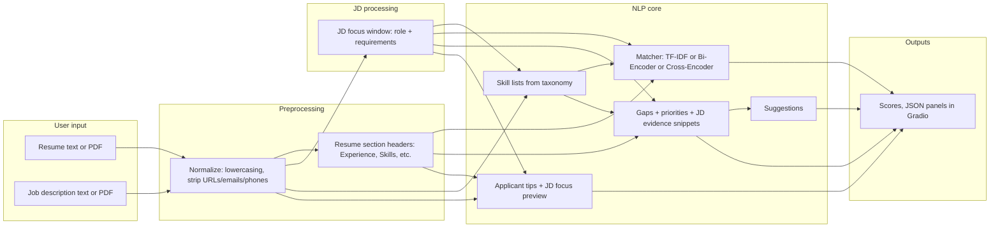

# Resume-to-Job-Description Matcher with Gap Analysis

**User guide** (course submission): this README doubles as the project user guide. A longer technical reference lives in [`system_details.md`](system_details.md).

---

## Demo link

**Live demo (add your URL after deployment):**  
`[https://huggingface.co/spaces/ritik123gaire/resume-jd-analyzer]

**Local demo (one command after setup):** from the repository root, with the virtual environment activated, run:

```bash
python app/gradio_app.py
```

Then open the URL shown in the terminal (by default `http://127.0.0.1:7860`). That is the intended “essentially one click” workflow once dependencies are installed.

---

## Introduction

**What this system does .**  
Job postings are long. Resumes are dense. This tool helps someone applying for a job **compare their resume to a specific posting** and get structured feedback: a **match score**, **lists of skills** the system noticed on each side, **gaps** where the posting asks for something the resume does not clearly show, and **concrete suggestions** for how to strengthen the resume. It also highlights **which part of the job text** was used for scoring when the posting includes a lot of corporate boilerplate, and offers simple **formatting tips** so the document is easier for both humans and parsers to read.

**What it is not.**  
It does not predict whether you will get an interview or an offer. It is a **proof-of-concept assistant** that combines classical text statistics, modern neural similarity, and lightweight rules so you can iterate on your materials with clearer priorities.

**Why it might feel “technical” anyway.**  
Under the hood it uses standard NLP building blocks (word statistics and pretrained neural models). The interface stays simple: paste text or upload files, pick a scoring style, press one button, read the outputs.

---

## Usage

### Prerequisites

- Python 3.10+ recommended (tested with 3.12).
- Internet access the **first** time you run matchers that download pretrained weights from Hugging Face.

### Install (once)

```bash
python -m venv .venv
.venv\Scripts\activate
pip install -r requirements.txt
python -m spacy download en_core_web_sm
```

On macOS/Linux, use `source .venv/bin/activate` instead of `.\.venv\Scripts\activate`.

### Run the demo

```bash
python app/gradio_app.py
```

Open the browser URL printed by Gradio. No separate “start server” step is required beyond this command.

### Using the interface (straightforward path)

1. Paste **resume** text (or upload `.txt` / `.pdf`).
2. Paste **job description** text (or upload `.txt` / `.pdf`).
3. Choose a **matching approach**: `tfidf` (fast, keyword-oriented), `bi_encoder` (default, semantic + skill alignment), or `cross_encoder` (pairwise neural, heavier).
4. Click **Analyze Match**.
5. Read outputs in order: **Match score** → **Extracted skills** → **Skill gaps** → **Improvement suggestions** → **Score breakdown** → **Applicant help** (shows what slice of the JD was focused for scoring, plus resume tips).

### Example inputs and what is interesting about the outputs

**Example A — strong alignment (short texts)**

*Resume:*

```text
Data analyst with Python, SQL, Tableau, and AWS. Built dashboards and automated reports.
```

*Job description:*

```text
Need data analyst with SQL, Python, Tableau, cloud exposure, and strong communication.
```

*What you should see:*  
Scores tend to be **higher** on TF-IDF and bi-encoder because vocabulary overlaps. **Gaps** may still list **communication** if that word is not literally on the resume. **Suggestions** quote short **JD evidence** when possible and tag items as must-have / preferred style labels. **Applicant help** shows whether a longer JD would have been trimmed to a “role-focused” window (here the text is short, so focus logic may use the full posting).

**Example B — long corporate posting (what is “cool” here)**  
Paste a real posting that includes HR boilerplate, benefits, and legal footers. The system tries to **focus on the role and qualifications** for scoring and for JD skill extraction, then shows a **preview** of that focused text under **Applicant help**. That directly addresses the common frustration “the job is a match but the score is low because the posting is huge.”

**Example C — mismatch on purpose**

*Resume:* `Frontend developer with React, JavaScript, and CSS.`  
*JD:* `Machine learning engineer with Python, PyTorch, NLP, and Docker.`

*What you should see:*  
Lower match scores and **more gaps** (e.g., Python, PyTorch, NLP, Docker if those appear in the JD skill list). This demonstrates that the tool is **not** always going to say “great match.”

### Optional: batch experiments (ARI 525)

From the repository root:

```bash
python scripts/run_experiments.py
```

Writes `results/metrics/experiment_summary.json` comparing all three approaches.

### Optional: fine-tune the cross-encoder

```bash
python scripts/train_cross_encoder.py --data data/evaluation/labeled_pairs.json --epochs 2 --batch-size 8 --output models/cross_encoder
```

---

## Documentation

This section is the **behind-the-scenes** description: models, data, frameworks, data flow, experiments, and design rationale.

### Extended technical reference

For field-level descriptions, formulas, and file maps, see **[`system_details.md`](system_details.md)**.

### High-level idea

The demo is a **pipeline**: clean and segment text → **focus long job postings** on role-relevant lines when possible → **extract skills** from dictionaries → **score** resume vs focused JD with one of three methods → **find gaps** between JD skills and resume skills (**plus inferred requirement terms when useful**) → **generate suggestions** with JD snippets → run **lightweight resume checks** for applicants.

### Flowchart (user input to output)



### Core components

| Component | Location | Role |
|-----------|----------|------|
| Text preprocessor | `src/preprocessing.py` | PDF/text loading, normalization, resume section detection (including “Core Skills” style headers). |
| JD focus | `src/jd_focus.py` | Line-based heuristics to keep role/requirements text and drop common footer blocks (pay, legal, etc.). |
| Skill extractor | `src/skill_extraction.py` | Dictionary + alias matching; regex-assisted certifications. |
| TF-IDF matcher | `src/matching/tfidf_matcher.py` | `TfidfVectorizer` + cosine similarity baseline. |
| Bi-encoder matcher | `src/matching/biencoder_matcher.py` | Sentence embeddings + optional skill-token alignment. |
| Cross-encoder matcher | `src/matching/crossencoder_matcher.py` | Pairwise transformer relevance; logits mapped through sigmoid to \([0,1]\). |
| Gap analyzer | `src/gap_analysis.py` | Lexical near-match + requirement-term inference from JD phrasing, noisy-phrase filtering, JD snippets, suggestions. |
| Applicant checks | `src/applicant_checks.py` | Simple resume clarity heuristics. |
| Orchestrator | `src/pipeline.py` | Wires everything into `AnalysisOutput`. |
| UI | `app/gradio_app.py` | Gradio Blocks interface. |

### Pretrained models (architecture, training, compute, data, limitations)

#### Bi-encoder: `sentence-transformers/all-MiniLM-L6-v2`

- **Architecture:** MiniLM-style **6-layer Transformer** encoder; pooling to a fixed-size sentence embedding (typically 384 dimensions). Sentence-BERT style training encourages semantically similar sentences to be close in cosine space.
- **Training (high level):** Multi-task supervised + contrastive objectives on sentence pairs (details in the model card on Hugging Face). **Not** trained on your resume–JD pairs by default.
- **Compute:** Inference on **CPU is feasible** for interactive demos; GPU speeds up batching. First download caches weights locally.
- **Training data (public model):** Large general-domain sentence corpora; **English-heavy**. May align better with mainstream tech JD wording than with niche domains.
- **Known limitations / biases:** Domain and demographic **mismatch** vs. all resumes and employers worldwide; can over-weight generic “corporate” language if the JD is not focused; semantic similarity is **not** the same as qualification compliance.

#### Cross-encoder: `cross-encoder/ms-marco-MiniLM-L-6-v2`

- **Architecture:** **6-layer cross-attention** encoder that jointly encodes a **pair** of texts (here, resume string vs JD string). Outputs a **relevance logit**; this project converts it with a **sigmoid** to a probability-like score in \([0,1]\) for display and blending.
- **Training (high level):** Trained on **MS MARCO** passage ranking–style supervision (relevance labels for query–passage pairs). Optimized for **relatively short** queries vs passages, not necessarily full CV vs full careers-page text.
- **Compute:** Heavier than bi-encoder per pair; `max_length` truncation (512 tokens in code) means very long inputs are **partially unseen** by the model.
- **Training data (public model):** Web and MS MARCO distributions—**biases** toward English web text, search-like queries, and document styles found in that corpus.
- **Known limitations:** Long postings and resumes can truncate; scores are **calibrated for the MS MARCO task**, not for hiring; pairing order is `(resume, jd_focused)` in this app.

#### TF-IDF (no neural weights)

- **Model:** `sklearn.feature_extraction.text.TfidfVectorizer` with English stop words and word + bigram features (see code). **No** pretrained neural weights; fitted **on the two documents** (resume vs focused JD) per request in the app.
- **Compute:** Very fast; good baseline for **lexical** overlap.
- **Limitations:** Misses paraphrases; sensitive to boilerplate token mass in unconcentrated JDs (JD focus mitigates this in the app).

## Datasets used in this repository

| Dataset / artifact | Role | Size (current) | Collection / notes |
|--------------------|------|----------------|----------------------|
| `data/evaluation/labeled_pairs.json` | Main evaluation set for resume–JD matching; can also be reused for optional reranker / cross-encoder fine-tuning | Current repository subset; see local file for exact count | Derived from the **Resume and Job Description** dataset on Kaggle, then adapted into labeled resume–job pairs with fields such as `resume_id`, `jd_id`, `resume_text`, `jd_text`, and `label` on a **1–5** match-quality scale. The local file in this repo is a processed evaluation artifact, not the raw Kaggle export. |
| Skill vocabulary | `DEFAULT_SKILL_DB` in `src/skill_extraction.py` | Dozens of curated strings | Hand-curated skill list used for lightweight skill extraction and overlap features. It is a practical seed vocabulary, **not** a complete ontology or standardized taxonomy such as O*NET. |
| Raw corpora / source data | Upstream source for evaluation-pair construction | External dataset | Source data comes from Kaggle: **Resume and Job Description** — https://www.kaggle.com/datasets/pranavvenugo/resume-and-job-description |

**Annotation protocol / label meaning:**  
Each resume–job pair is assigned an **overall fit** score from **1 to 5**, where a typical rubric is: **1** = unrelated or poor fit, **3** = partial overlap, **5** = strong match in skills and responsibilities. If multiple job descriptions are paired with the same candidate, keep `resume_id` stable so ranking metrics such as **MRR** or **NDCG** remain meaningful.

**Important note on the local evaluation file:**  
`labeled_pairs.json` is a **processed / derived benchmark artifact**, not synthetic data, if it was built from the Kaggle source dataset. It should be described as a local evaluation set created from the upstream dataset after preprocessing, pairing, and labeling.

**Class balance note:**  
If the 1–5 labels are converted into binary relevance, for example using **label >= 3.5** as positive, the final class balance depends on the pair-construction and annotation strategy. Report the actual balance from the local file rather than assuming it in advance.ass / distribution note:** With binary thresholds derived from labels ≥ 3.5 as “positive,” class balance depends on how you label. The current stub has one high and one low label (balanced for toy tests, not for inference).

### External frameworks and what we use from them

| Framework | Functionality used |
|-----------|---------------------|
| **Gradio** | `Blocks`, text/file inputs, JSON `Code` outputs, `launch()` for local or hosted demos. |
| **scikit-learn** | `TfidfVectorizer`, `cosine_similarity`. |
| **sentence-transformers** | `SentenceTransformer` encode; `CrossEncoder` predict and optional `fit` for fine-tuning. |
| **transformers / torch** | Back-end for pretrained weights and training loops invoked by sentence-transformers. |
| **PyPDF2** | `PdfReader` text extraction for uploads. |
| **spaCy** | Listed in requirements for optional NLP extensions; core pipeline described here runs without spaCy in the critical path. |

### Experiments (required for ARI 525)

**Procedure.**  
`scripts/run_experiments.py` loads labeled pairs, scores each with TF-IDF, bi-encoder, and cross-encoder on the **stored** `resume_text` and `jd_text` (the script does **not** apply JD-focus heuristics—use short JDs in the JSON for comparable benchmark behavior, or extend the script to call `focus_job_description` if desired).

**Metrics.**

- **Binary precision / recall / F1:** labels ≥ **3.5** are positive; predictions positive if model score ≥ **0.7** (i.e., 3.5/5 on a 0–1 scale). See `src/evaluation.py`.
- **Ranking:** **NDCG@5** and **MRR** computed per `resume_id` group (with only one JD per resume in the stub file, these are illustrative).
- **Efficiency:** average milliseconds per scored pair and throughput (pairs/sec), with repeated timing for TF-IDF.

**Results table (subset `training_pairs_200.json`, run locally).**  
*Caveat: **n = 200** pairs—still small; expand and label more data for stronger claims.*

| Approach | Precision | Recall | F1 | NDCG@5 | MRR | Avg latency (ms/pair) |
|----------|-----------|--------|-----|--------|-----|------------------------|
| TF-IDF | 1.00 | 0.04 | 0.08 | 0.99 | 0.98 | ~2.18 |
| Bi-encoder | 1.00 | 0.19 | 0.32 | 0.93 | 0.89 | ~68.54 |
| Cross-encoder | 0.92 | 0.69 | 0.79 | 0.98 | 0.97 | ~87.49 |

**Why TF-IDF recall is low on this subset.**  
Many pairs receive cosine-style scores **below** the fixed **0.7** decision threshold (see `run_binary_metrics_from_scores` in `src/evaluation.py`), so few pairs are predicted “high match.” The cutoff is not tuned on this dataset; a sparse lexical score can fall under 0.7 even when humans would rate the match as decent.

**Approach selected for the default UI.**  
**Bi-encoder** is the default dropdown: strong **semantic** signal for paraphrases, still interactive on CPU for typical paste sizes, and it composes well with **JD-focused** text and a **skill-alignment** term in the pipeline. Cross-encoder is available for **pairwise** scoring when users want a second opinion; TF-IDF remains the **transparent lexical baseline**.

**Human evaluation (recommended addition for the course).**  
Have 3–5 people rate usefulness of gaps/suggestions on a 1–5 scale for 10–20 anonymized pairs; report means and disagreements. This is not automated in the repo but strengthens the “evaluation” story.

---

## Contributions

What we **built or integrated** in this project (beyond “load one model and call predict”):

- **End-to-end pipeline** from messy user input (including PDF) to multiple structured JSON outputs, with a **single** Gradio action.
- **Three complementary matchers** (TF-IDF, bi-encoder, cross-encoder) under one API and UI, plus a **scripted experiment harness** with classification, ranking, and latency.
- **JD focus extraction** so long postings do not dominate similarity scores; **transparent preview** for users.
- **Section-aware resume handling**, including recognition of **“Core Skills”** style headers for overlap scoring.
- **Gap analysis** with **JD evidence snippets**, **requirement-style labels**, **fallback requirement-term inference** for out-of-vocabulary JD wording, and filtering to suppress boilerplate/non-skill phrases.
- **Applicant-oriented resume checks** (length, bullets, years, headers) separate from the match score.
- **Cross-encoder score calibration**: sigmoid mapping from MS MARCO logits so displayed percentages are not stuck at zero.
- **Documentation**: this user-guide README and **`system_details.md`** for implementers.

---

## Limitations

**What users might expect—but the system does not do well today**

- **Full skill coverage:** Primary extraction is still dictionary-based (plus a few certification regexes). Gap analysis now adds a fallback pass that infers some requirement terms from JD wording, but it is still heuristic and may miss niche/domain-specific skills.
- **Legal / fair hiring use:** The tool is **not** validated for employment decisions, compliance, or bias auditing across demographics; pretrained models carry **language and domain biases** from their training corpora.
- **Very creative resume layouts:** Section detection uses **whole-line header** patterns; unusual formatting may land most content in `other`, weakening section-weighted features.
- **Cross-encoder + very long texts:** Token limits mean the model may not see the entire resume and JD; JD focus reduces but does not eliminate this.


---

## Project structure

```text
ResumeJDAnalyzer/
  app/
    gradio_app.py
  data/
    evaluation/labeled_pairs.json
    raw/...
  scripts/
    run_experiments.py
    train_cross_encoder.py
  src/
    preprocessing.py
    jd_focus.py
    skill_extraction.py
    gap_analysis.py
    applicant_checks.py
    evaluation.py
    pipeline.py
    matching/
      tfidf_matcher.py
      biencoder_matcher.py
      crossencoder_matcher.py
  results/metrics/
  requirements.txt
  README.md                 ← this user guide
  system_details.md         ← extended system reference
```


